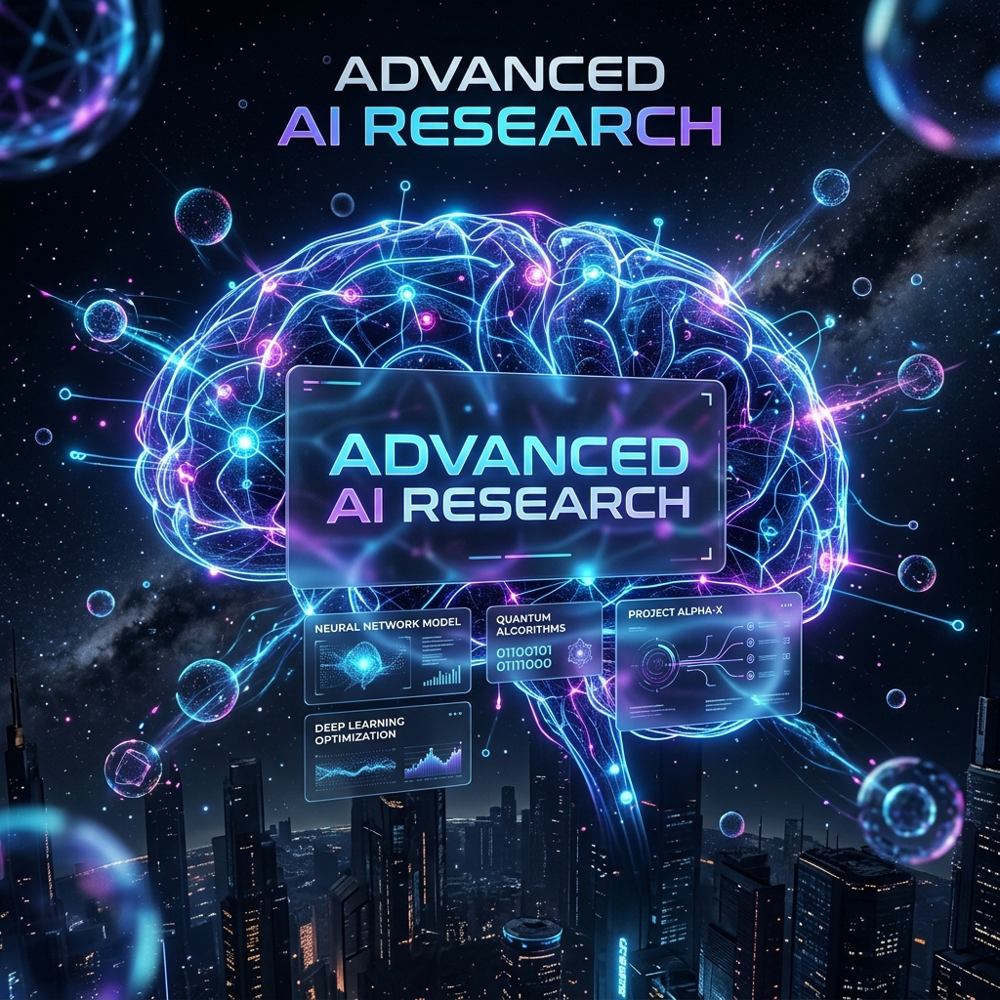

# Abhi's AI Research Lab (Multi-Agent AI Research System)

Welcome to **Abhi's AI Research Lab**, a next-generation autonomous AI research platform. This system leverages the power of multiple AI agents working in tandem to conduct deep research on any given topic, scrape relevant information, synthesize a comprehensive report, and critically evaluate its own work.

> [!IMPORTANT]
> 🎥 **Watch the Demo Video**
> 
> [](https://drive.google.com/file/d/1kwf-YAk9AY7uIeaYHPjhsG_Z_T8GlSBZ/view?usp=sharing)

## 🌟 Key Features

- **Multi-Agent Architecture**: Uses specialized AI agents (Search, Reader, Writer, Critic) to divide and conquer the research task.
- **Deep Web Search & Scraping**: Integrates with the Tavily Search API for accurate web results and BeautifulSoup for extracting deep content from reliable sources.
- **Automated Report Generation**: Synthesizes gathered data into a well-structured Markdown report complete with Introduction, Key Findings, Conclusion, and Sources.
- **Self-Critique Mechanism**: An independent Critic Agent reviews the final report, scores it out of 10, and provides constructive feedback on strengths and areas for improvement.
- **Beautiful UI**: Built with Streamlit and styled with custom CSS featuring a premium dark theme, glassmorphism, floating orbs, and dynamic animations.
- **Export Options**: Download the final research report instantly in Markdown (`.md`) or PDF (`.pdf`) formats.

## 🛠️ Technology Stack

- **Frontend**: [Streamlit](https://streamlit.io/) with custom CSS injections.
- **Orchestration**: [LangChain](https://python.langchain.com/) for building and chaining the AI agents.
- **LLM**: Google Gemini API (`gemini-2.5-flash` / `gemini-pro`) via `langchain-google-genai`.
- **Search API**: [Tavily API](https://tavily.com/) for real-time web search capability.
- **Web Scraping**: `requests` and `BeautifulSoup4`.
- **PDF Generation**: `fpdf` for converting Markdown reports to downloadable PDFs.

## 🧠 The Agents

The system orchestrates a 4-step pipeline using specialized agents:

1. **Search Agent**: Scans the web using Tavily to find recent, relevant, and reliable information based on your topic.
2. **Reader Agent**: Evaluates the search results, picks the most relevant URL, and scrapes its deep text content, filtering out noise like scripts and navbars.
3. **Writer Agent**: Takes the combined search snippets and scraped content, synthesizing it into a detailed, structured, and factual research report.
4. **Critic Agent**: Reviews the Writer Agent's report, providing a strict score, highlighting strengths, identifying areas for improvement, and giving a one-line verdict.

## 🚀 Getting Started

### Prerequisites
Make sure you have Python 3.8+ installed on your system.

### 1. Clone or setup the repository
Navigate to your workspace directory:
```bash
cd /path/to/Multi-Agent-AI-Research-System
```

### 2. Set up a Virtual Environment (Recommended)
```bash
python -m venv venv
# On Windows:
venv\Scripts\activate
# On macOS/Linux:
source venv/bin/activate
```

### 3. Install Dependencies
```bash
pip install -r requirements.txt
```
*(Ensure your `requirements.txt` includes: `streamlit`, `langchain`, `langchain-google-genai`, `tavily-python`, `beautifulsoup4`, `requests`, `fpdf`, `python-dotenv`, `rich`)*

### 4. Configure Environment Variables
Create a `.env` file in the root directory and add your API keys:
```env
GOOGLE_API_KEY=your_google_gemini_api_key_here
TAVILY_API_KEY=your_tavily_api_key_here
```

### 5. Run the Application
Start the Streamlit server:
```bash
streamlit run app.py
```
The application will launch in your default web browser (usually at `http://localhost:8501`).

## 📁 Project Structure

- `app.py`: The main Streamlit frontend application, UI components, and state management.
- `pipeline.py`: Defines the sequential research pipeline (`run_research_pipeline`) connecting the agents.
- `agents.py`: Contains the LangChain agent definitions (Search, Reader) and chains (Writer, Critic) powered by Google Gemini.
- `tools.py`: Custom LangChain tools (`web_search`, `scrape_url`) used by the agents to interact with the web.
- `.env`: (Not tracked in version control) Stores private API keys.

## 📝 License
This project is open-source and created for AI research and development purposes.

---
*Engineered with by Abhi❤️ .*
